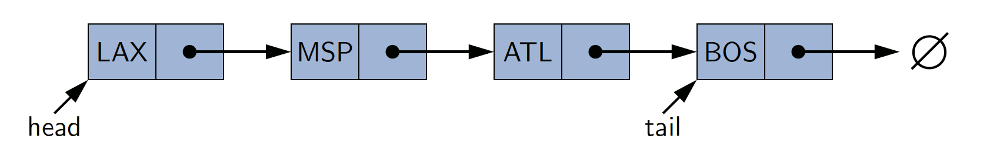
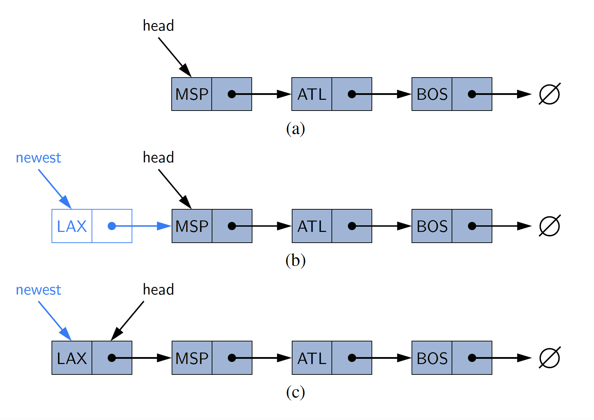
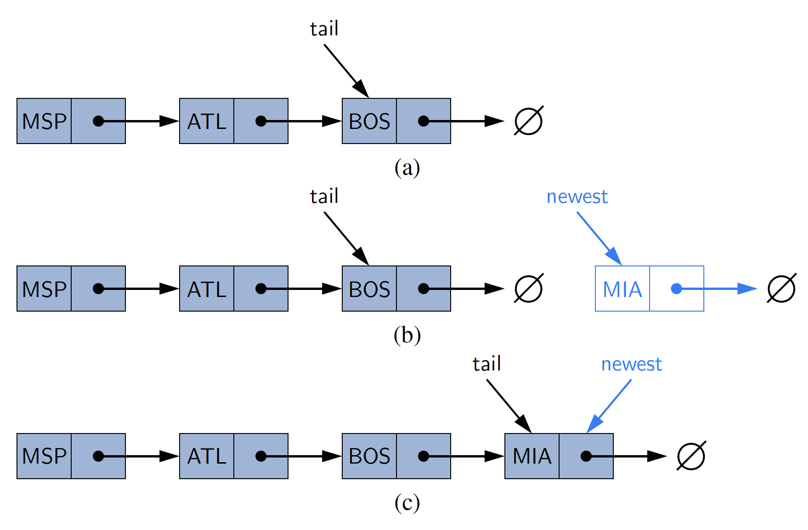
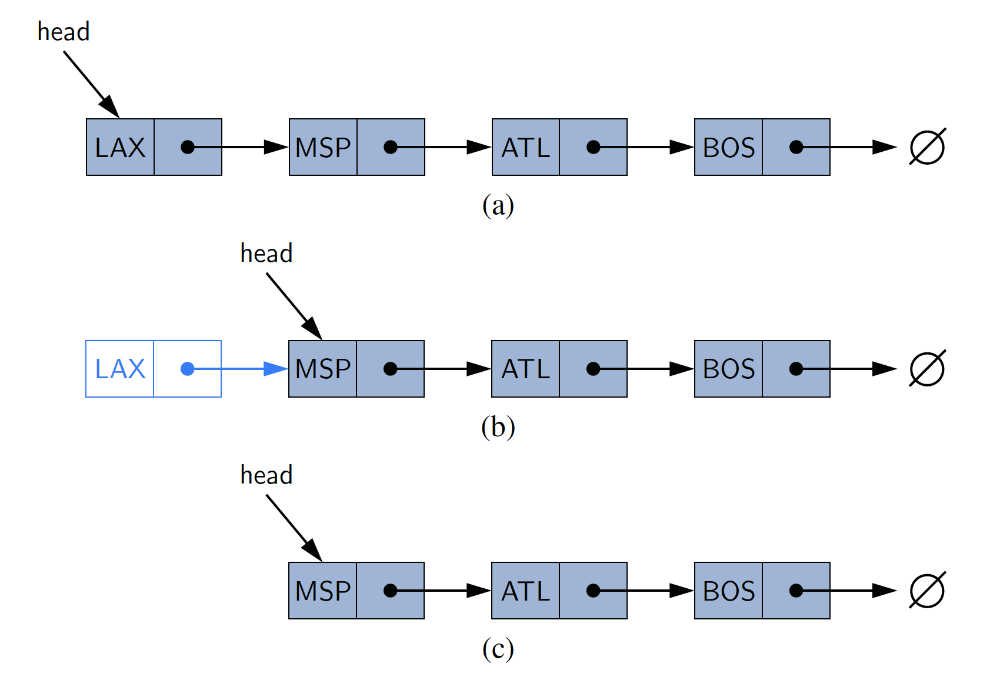

# SinglyLinkedList

* [Introduction](#introduction)
* [Contract](#contract)
* [Implementations](#implementations)

## Introduction

A _**linked list**_, in its simplest form, is a collection of _**nodes**_ that
collectively form a linear sequence. In a _**singly linked list**_, each node
stores a reference to an object that is the element of the sequence, as well as
a reference to the next node in the list.

The linked list instance must keep a reference to the first node in the list,
known as the _**head**_. Without a reference to the head, there is no way to
locate that node or others indirectly. The last node of the list is known as
the _**tail**_. There is also a reference to the tail to avoid unnecessary
traversal.

Linked lists are traversed by taking a node and looking at its _"next"_
node reference and continuing until reaching the node that does not have a
_"next"_ reference, which is the tail.



```java
class SinglyLinkedList<E> {
    Node<E> head;
    // in tail, next is null.
    Node<E> tail;
    
    static class Node<E> {
        E element;
        Node<E> next;
    }
}
```

## Contract

* [`size()`](#size) - Returns the number of elements in the list
* [`isEmpty()`](#isempty) - Returns `true` if the list is empty, and `false` otherwise.
* [`first()`](#first) - Returns (does not remove) the first element in the list.
* [`last()`](#last) - Returns (does not remove) the last element in the list.
* [`addFirst(e)`](#addfirste) - Adds a new element to the front of the list.
* [`addLast(e)`](#addlaste) - Adds a new element to the end of the list.
* [`removeFirst()`](#removefirst) - Removes and returns the first element of the list.


## Implementations

### `size()`

An internal count should be kept and updated as elements are added and
removed from the list. This allows for easy discovery without having to
traverse the list

```java
public int size() {
    return size;
}
```

### `isEmpty()`

This can easily be determined by checking the `size()` of the list.

```java
public boolean isEmpty() {
    return size() == 0;
}
```

### `first()`

There should be a reference to the first (`head`) node in the list. So getting
the first element is simply a matter of getting the element from the `head` node.

```java
public E first() {
    return isEmpty() ? null : head.getElement();
}
```

### `last()`

There should be a reference to the last (`tail`) node in the list. So getting
the last element is simply a matter of getting the element from the `tail` node.

```java
public E last() {
    return isEmpty() ? null : tail.getElement();
}
```

### `addFirst(e)`

Adding an element to the front of the list can be accomplished with the
following steps:

1. Create a new node with the `head` as its _"next"_ node
2. Assign the new node to `head`
3. Check to see if the list is empty. If it is, also set the node as the `tail` also.
4. Increment the list size.


   
```java
 public void addFirst(E e) {
     head = new Node<>(e, head);
     if (isEmpty()) {
     tail = head;
     }
     size++;
}
```

### `addLast(e)`

Adding an element to the end can be accomplished with the following steps:

1. Create a new node with its next node as null. The `tail` always has a null _"next"_.
2. Check if the list is empty. If it is, set the `head` as the new node. If it's
   not empty, take the current `tail` and make its "next" node point to the
   new node.
3. Make the new node the current `tail` node.
4. Increment the size.



```java
 public void addLast(E e) {
     Node<E> newNode = new Node<>(e, null);
     if (isEmpty()) {
         head = newNode;
     } else {
         tail.setNext(newNode);
     }
     tail = newNode;
     size++;
 }
```

### `removeFirst()`

Removing the first element is simply a reverse of adding the first element:

1. If the list is empty, return null
2. Take the `head` and make its "next" node the current head. If this was the
   only element in the list, this will automatically make the `head` null, as
   the `head` is also the `tail` when there is only one element.
3. Decrement the list size
4. If the list is empty, make the `tail` null



```java
 public E removeFirst() {
     if (isEmpty()) return null;
     E element = head.getElement();
     head = head.getNext();
     size--;
     if (isEmpty()) {
         tail = null;
     }
     return element;
 }
```