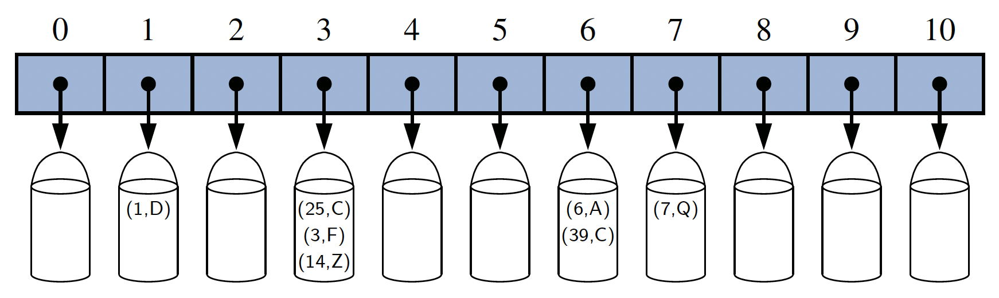
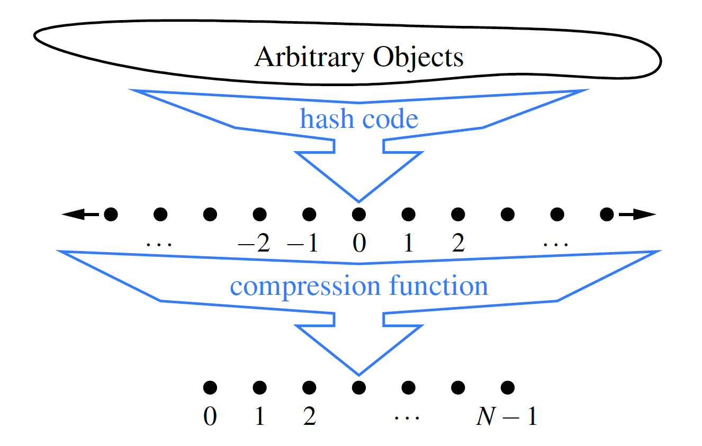

# HashTable

* [Introduction](#introduction)
    * [Hash Functions](#hash-functions)
        * [Hash Codes](#hash-codes)
        * [Compression Functions](#compression-functions)
            * [Division Method](#the-division-method)
            * [MAD Method](#the-mad-method)
        * [Collision-Handling Schemes](#collision-handling-schemes)
            * [Separate Chaining](#separate-chaining)
* [Implementation](#implementation)
    * [AbstractHashMap](#abstracthashmap)
    * [ChainHashMap](#chainhashmap)

## Introduction

A hash table is the use of a **hash function** to map general keys to corresponding indices in a table. Ideally, keys will be well distributed in the range from 0 to _N_–1 by a hash function, but in practice there may be two or more distinct keys that get mapped to the same index. As a result, we will conceptualize
our table as a **bucket array**.

### Hash Functions

The goal of a **hash function**, _h_, is to map each key _k_ to an integer in the range [0,_N_ −1], where _N_ is the capacity of the bucket array for a hash table. The main idea of this approach is to use the hash function value, _h(k)_, as an index into our bucket array, _A_. That is, we store the entry _(k,v)_ in the bucket _A[h(k)]_.

If there are two or more keys with the same hash value, then two different entries will be mapped to the same bucket in A. In this case, we say that a **collision** has occurred. We say that a hash function is “good” if it maps the keys in our map so as to sufficiently minimize collisions.

It is common to view the evaluation of a hash function, _h(k)_, as consisting of
two portions – a **hash code** that maps a key k to an integer, and a **compression function** that maps the hash code to an integer within a range of indices, [0,N −1].

### Hash Codes

The first action that a hash function performs is to take an arbitrary key k in our
map and compute an integer that is called the **hash code** for _k_; this integer need not be in the range [0,N −1], and may even be negative. We desire that the set of hash codes assigned to our keys should avoid collisions as much as possible. For if the hash codes of our keys cause collisions, then there is no hope for our compression function to avoid them.

### Compression Functions

The hash code for a key k will typically not be suitable for immediate use with a
bucket array, because the integer hash code may be negative or may exceed the capacity of the bucket array. Thus, once we have determined an integer hash code for a key object k, there is still the issue of mapping that integer into the range [0,_N_−1]. This computation, known as a **compression function**, is the second action performed as part of an overall hash function. A good compression function is one that minimizes the number of collisions for a given set of distinct hash codes.

#### The Division Method

A simple compression function is the **division method**, which maps an integer _i_ to

>_i_ mod _N_

where _N_, the size of the bucket array, is a fixed positive integer.

#### The MAD Method

A more sophisticated compression function, which helps eliminate repeated patterns
in a set of integer keys, is the **Multiply-Add-and-Divide** (or “MAD”) method.
This method maps an integer i to

>_[(ai+b) mod p] mod N_

where _N_ is the size of the bucket array, _p_ is a prime number larger than _N_, and _a_ and _b_ are integers chosen at random from the interval _[0, p−1]_, with _a > 0_. This compression function is chosen in order to eliminate repeated patterns in the set of hash codes and get us closer to having a “good” hash function, that is, one such that the probability any two different keys collide is _1/N_.

### Collision-Handling Schemes

#### Separate Chaining

A simple and efficient way for dealing with collisions is to have each bucket _A[j]_
store its own secondary container, holding all entries _(k,v)_ such that _h(k) = j_. A natural choice for the secondary container is a [small map instance implemented using an unordered list](../map/README.md#unsortedtablemap).

## Implementation

### AbstractHashMap

The abstract hash map does not provide any concrete representation of a table of buckets. With a "Separate Chaining" implementation, each bucket will be a secondary map. In our design, the `AbstractHashMap` class presumes the
following to be abstract methods—to be implemented by each concrete subclass:

* `createTable()` – This method should create an initially empty table having
size equal to a designated capacity instance variable.
* `bucketGet(h, k)` – This method should mimic the semantics of the public `get`
method, but for a key `k` that is known to hash to bucket `h`.
* `bucketPut(h, k, v)` – This method should mimic the semantics of the public `put`
method, but for a key `k` that is known to hash to bucket `h`.
* `bucketRemove(h, k)` – This method should mimic the semantics of the public
`remove` method, but for a key `k` known to hash to bucket `h`.
* `entrySet()` – This standard map method iterates through all entries of the
map. We do not delegate this on a per-bucket basis because “buckets” in open addressing are not inherently disjoint.
  

### ChainHashMap

To represent each bucket for separate chaining, we use an instance of the simpler
`UnsortedTableMap`. The entire hash table is then represented as a fixed-capacity array A of the secondary maps. Each cell, A[h], is initially a null reference; we only create a secondary map when an entry is first hashed to a particular bucket.

As a general rule, we implement _bucketGet(h, k)_ by calling _A[h].get(k)_, we
implement _bucketPut(h, k, v)_ by calling _A[h].put(k, v)_, and _bucketRemove(h, k)_
by calling _A[h].remove(k)_.
