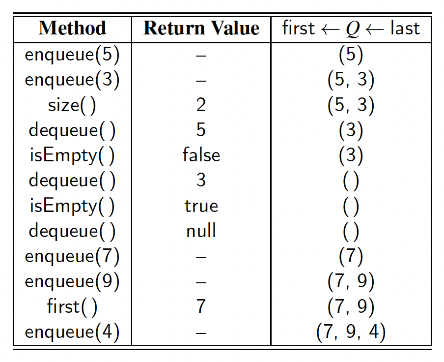

# Queue

* [Introduction](#introduction)
* [Contract](#contract)
* [Implementation](#implementation)
    * [Array-Based Queue](#array-base-queue)
    * [LinkedList-Based Queue](#linkedlist-based-queue)

## Introduction

Another fundamental data structure is the **queue**. It is a close “cousin” of the stack, but a queue is a collection of objects that are inserted and removed according to the **first-in, first-out (FIFO)** principle. That is, elements can be inserted at any time, but only the element that has been in the queue the longest can be next removed.

We usually say that elements enter a queue at the back and are removed from
the front. A metaphor for this terminology is a line of people waiting to get on an
amusement park ride. People waiting for such a ride enter at the back of the line
and get on the ride from the front of the line.

## Contract

* `enqueue(e)` – Adds element _e_ to the back of queue.
* `dequeue()` – Removes and returns the first element from the queue (or null if the queue is empty).
* `first()` – Returns the first element of the queue, without removing it (or null if the queue is empty).
* `size()` – Returns the number of elements in the queue.
* `isEmpty()` – Returns a boolean indicating whether the queue is empty.

By convention, we assume that elements added to the queue can have arbitrary
type and that a newly created queue is empty.

```java
public interface Queue<E> {
    int size();
    boolean isEmpty();
    void enqueue(E e);
    E dequeue();
    E first();
}
```



## Implementation

### Array-Base Queue

### LinkedList-Based Queue

we can easily adapt a singly linked list to implement the queue ADT while supporting worst-case O(1)-time for all operations, and without any artificial limit on the capacity. The natural orientation for a queue is to align the front of the queue with the front of the list, and the back of the queue with the tail of the list, because the only update operation that singly linked lists support
at the back end is an insertion.


