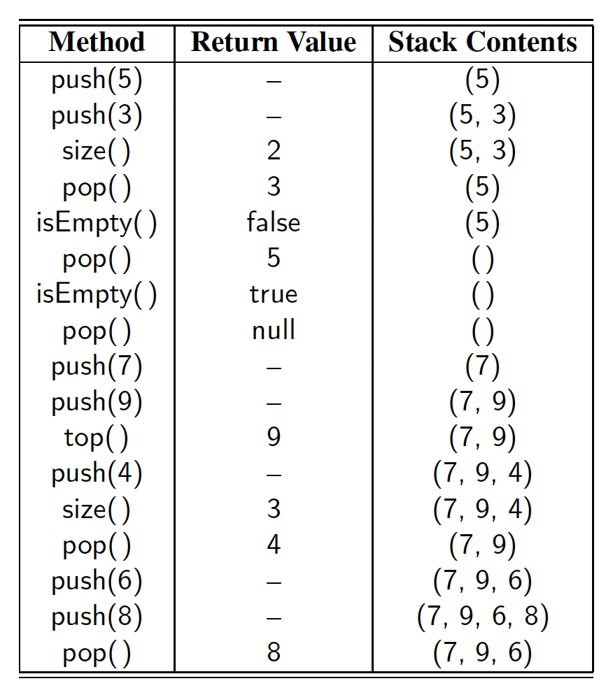

# Stack

* [Introduction](#introduction)
* [Contract](#contract)
* [Implementation](#implementation)
    * [Array-Based Stack](#array-based-stack)
    * [LinkedList-Based Stack](#linkedlist-based-stack)


## Introduction

A **stack** is a collection of objects that are inserted and removed according to the
**last-in, first-out (LIFO)** principle. A user may insert objects into a stack at any time, but may only access or remove the most recently inserted object that remains (at the so-called “top” of the stack).

**Example:** Internet Web browsers store the addresses of recently visited sites
on a stack. Each time a user visits a new site, that site’s address is “pushed” onto the stack of addresses. The browser then allows the user to “pop” back to previously visited sites using the “back” button.

## Contract

* `push(e)` – Adds element _e_ to the top of the stack.
* `pop()` – Removes and returns the top element from the stack (or null if the stack is empty).
* `top()` – Returns the top element of the stack, without removing it (or null if the stack is empty).
* `size()` – Returns the number of elements in the stack.
* `isEmpty()` – Returns a boolean indicating whether the stack is empty.

By convention, we assume that elements added to the stack can have arbitrary type
and that a newly created stack is empty.

```java
public interface Stack<E> {
    int size();
    boolean isEmpty();
    void push(E e);
    E pop();
    E top();
}
```



## Implementation

### Array-Based Stack

As our first implementation of the stack ADT, we store elements in an array, named
data, with capacity _N_ for some fixed _N_. We oriented the stack so that the bottom
element of the stack is always stored in cell `data[0]`, and the top element of the
stack in cell `data[t]` for index _t_ that is equal to one less than the current size of the
stack.

```java
public class ArrayStack<E> implements Stack<E> {

    public static final int CAPACITY = 1000;
    private final E[] data;
    private int t = -1;

    public ArrayStack() {
        this(CAPACITY);
    }

    @SuppressWarnings("unchecked")
    public ArrayStack(int capacity) {
        data = (E[]) new Object[capacity];
    }

    @Override
    public int size() {
        return t + 1;
    }

    @Override
    public boolean isEmpty() {
        return t == -1;
    }

    @Override
    public void push(E e) {
        if (size() == data.length) {
            throw new IllegalStateException("Stack is full.");
        }
        data[++t] = e;
    }

    @Override
    public E pop() {
        if (isEmpty()) {
            return null;
        }
        E answer = data[t];
        data[t] = null;
        t--;
        return answer;
    }

    @Override
    public E top() {
        if (isEmpty()) {
            return null;
        }
        return data[t];
    }
}
```

The array implementation of a stack is simple and efficient. Nevertheless, this
implementation has one negative aspect—it relies on a fixed-capacity array, which
limits the ultimate size of the stack.

For convenience, we allow the user of a stack to specify the capacity as a parameter to the constructor (and offer a default constructor that uses capacity of 1,000). In cases where a user has a good estimate on the number of items needing to go in the stack, the array-based implementation is hard to beat. However, if the estimate is wrong, there can be grave consequences. If the application needs much less space than the reserved capacity, memory is wasted. Worse yet, if an attempt is made to push an item onto a stack that has already reached its maximum capacity, the implementation throws an IllegalStateException, refusing to store the new element.

### LinkedList-Based Stack

The Stack interface can be easily implemented using a singly [linked list](../lists/linked/singly/README.md) for storage. Unlike our array-based implementation, the linked-list approach has memory usage that is always proportional to the number of actual elements currently in the stack, and without an arbitrary capacity limit.

In designing such an implementation, we need to decide if the top of the stack is at the front or back of the list. There is clearly a best choice here, however, since we can insert and delete elements in constant time only at the front. With the top of the stack stored at the front of the list, all methods execute in constant time.

```java
public class LinkedStack<E> implements Stack<E> {

    private final LinkedList<E> list = new SinglyLinkedList<>();

    @Override
    public int size() {
        return list.size();
    }

    @Override
    public boolean isEmpty() {
        return list.isEmpty();
    }

    @Override
    public void push(E e) {
        list.addFirst(e);
    }

    @Override
    public E pop() {
        return list.removeFirst();
    }

    @Override
    public E top() {
        return list.first();
    }
}
```


